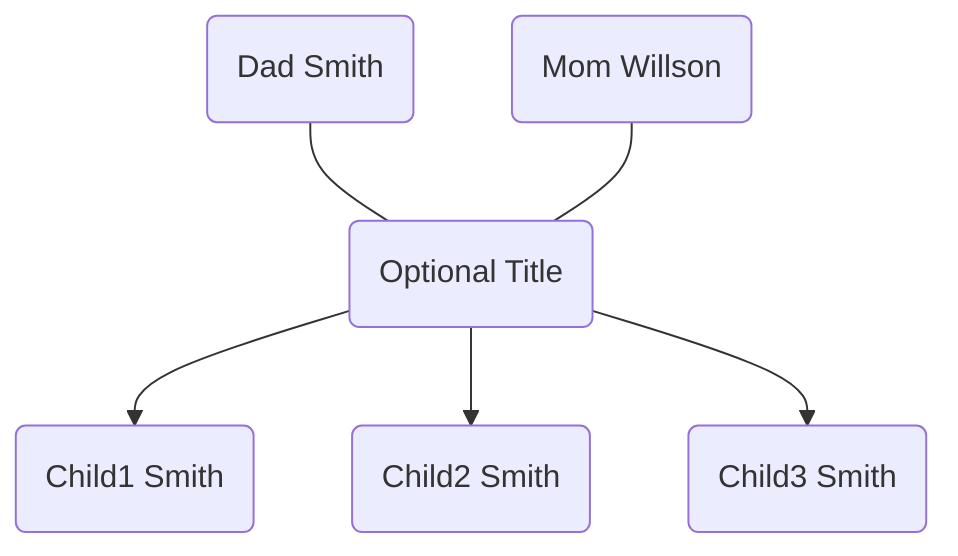

# Simple Family Tree Maker

Use a simple YAML syntax to create a visual family tree.

Here's an example of the family syntax:

```yaml
Mom Willson + Dad Smith [Optional Title]:
    - Child1
    - Child2
    - Child3
```

## Flowchart

(This might not render, depending on your markdown viewer.)



# Setup

Run `npm run dev` to start the server on `localhost:3000`.
