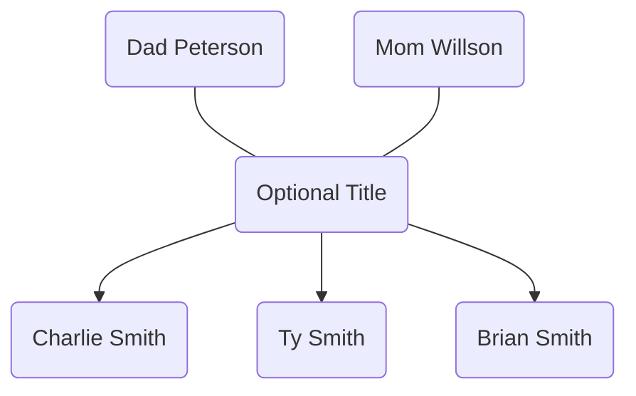

# Simple Family Tree Maker

Try the live editor at
[family-tree-maker.oxen.dev](https://family-tree-maker.oxen.dev).

The goal of this project is to make a platform-independent syntax to help record family trees. All other formats will die out, or become paid-to-use, but the mighty text file is here to stay.

This format is based off of YAML and compiles to Mermaid JS. It's easy to use, but can be parsed into trees easily.

### Features

Use a simple YAML syntax to create a visual family tree.

Here's an example of the family syntax:

```yaml
Mom Peterson + Dad Smith [Optional Title]:
    - Charlie
    - Ty
    - Brian
```

### Flowchart Output

(This might not render, depending on your markdown viewer.)



# Local Setup

This is made with Next.js 13 and the `/app` router.

Run `npm i;npm run dev` to start the server on `localhost:3000`.
